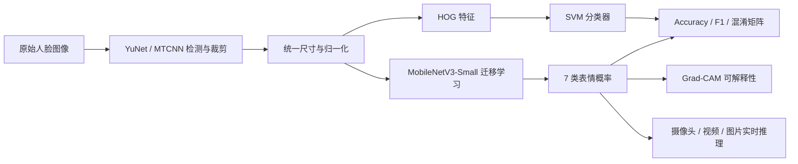

# 基于深度学习的人脸表情识别

> 一个用于机器学习与计算机视觉学习、复盘和持续改进的七类人脸表情识别项目。

项目最初使用一个简单的三层 CNN，在 FER2013 上训练几十轮后测试准确率约为 30%。在后续版本中，项目已从“课程代码”重构为可配置、可复现、可实时运行的学习项目：

- 使用预训练 MobileNetV3-Small 进行迁移学习，并通过数据增强和类别平衡改善训练效果
- 保留 HOG + SVM 作为传统机器学习对照基线
- 使用 FER2013 训练和测试，使用 CK+ 做跨数据集泛化评估
- 输出 Accuracy、Weighted F1、Macro F1、分类报告和混淆矩阵
- 使用真正的 Grad-CAM 展示模型关注区域
- 使用 OpenCV YuNet 完成轻量级实时人脸检测，并支持 MTCNN/Haar 回退
- 实时识别支持摄像头、视频和图片输入，包含预测平滑、FPS 显示和结果文件输出

> 本仓库是学习过程记录。数据集不随仓库上传，模型检查点默认也不提交，请按本文说明在本地生成。

## 当前版本改进

与最初版本相比，主要改动如下：

| 方面 | 原始版本 | 当前版本 |
|---|---|---|
| 模型 | 三层简单 CNN，从零训练 | MobileNetV3-Small 迁移学习，可切换 ResNet18/SimpleCNN |
| 输入尺寸 | 48×48 | 默认 96×96，可通过参数调整 |
| 数据增强 | 无 | RandomResizedCrop、水平翻转、旋转、颜色扰动 |
| 类别不平衡 | 未处理 | WeightedRandomSampler |
| 训练控制 | 固定 50 轮 | 自动设备选择、早停、学习率调度、梯度裁剪 |
| 损失函数 | CrossEntropyLoss | CrossEntropyLoss + Label Smoothing |
| 模型保存 | 只保存 state_dict | 保存架构、类别、输入尺寸、指标和优化器状态 |
| 路径 | 写死 `D:\emotion_exp` | 基于项目根目录，可用环境变量覆盖 |
| 评估 | 只保存 Accuracy/F1 | JSON 指标、分类报告和混淆矩阵图 |
| 可视化 | 平均特征响应 | 标准 Grad-CAM 与特征图 |
| 实时检测 | 依赖 TensorFlow/MTCNN | 默认 YuNet，支持 MTCNN/Haar 回退 |
| 实时功能 | 只支持摄像头 | 摄像头、视频、图片、预测平滑、FPS、输出文件 |

## 项目流程



## 数据集

### FER2013

FER2013 用于训练、验证和测试。对齐后的数据划分为：

| 数据划分 | 图像数量 |
|---|---:|
| train | 23,212 |
| val | 5,383 |
| test | 5,384 |

类别包括：

`angry`、`disgust`、`fear`、`happy`、`sad`、`surprise`、`neutral`

FER2013 存在明显的类别不平衡。例如训练集中 `happy` 有 6,275 张，而 `disgust` 只有 380 张。因此当前训练默认使用 WeightedRandomSampler，对少数类进行重采样。

### CK+

CK+ 用于评估跨数据集泛化能力。当前版本会把 `contempt` 近似映射到 `disgust`，并复用七分类模型。由于 CK+ 没有 `neutral` 类，且标签体系和采集环境与 FER2013 不同，CK+ 结果主要用于分析域差异，不适合与 FER2013 测试结果做严格同分布比较。

数据集仅保存在本地，不纳入 Git 仓库。使用时请从官方或合法发布渠道获取，并遵守原始许可。

## 模型与训练

### MobileNetV3-Small

默认模型使用 ImageNet 预训练权重，替换最后的分类层为 7 类输出：

- 特征提取：MobileNetV3-Small
- 输入：96×96 RGB
- 分类头：Linear(576→256) + Hardswish + Dropout + Linear(256→7)
- 参数量：约 1.08M

### 训练策略

- 训练/验证集：FER2013 aligned
- Batch Size：128
- 最大 Epoch：25
- 初始阶段冻结特征提取器 1 轮
- 分类头学习率：`5e-4`
- 特征提取器学习率：`5e-5`
- 优化器：AdamW
- 权重衰减：`1e-4`
- 学习率调度：ReduceLROnPlateau
- 早停：连续 6 轮验证准确率没有提升时停止
- 损失：CrossEntropyLoss + Label Smoothing
- 数据增强：随机缩放裁剪、水平翻转、旋转、颜色扰动
- 类别平衡：WeightedRandomSampler

训练会保存：

- `exp_result/checkpoints/emotion_best.pth`：验证集效果最好的模型
- `exp_result/checkpoints/emotion_last.pth`：最后一个 Epoch 的模型
- `exp_result/checkpoints/training_history.json`：每轮训练/验证指标和配置

### HOG + SVM 基线

`HOGSVM.py` 保留传统方法对照：

- 输入：48×48 灰度图
- HOG：窗口 48×48，Cell 16×16，Block 8×8，9 个 bin
- 分类器：RBF 核 SVM
- 参数：`C=10`、`gamma='scale'`、`class_weight='balanced'`
- 输出：SVM 模型、JSON 指标、Accuracy/F1 文本结果

## 实验结果

> 下表会在正式训练和完整评估结束后更新。

| 方法 / 数据集 | Accuracy | Weighted F1-score |
|---|---:|---:|
| HOG + SVM / FER2013 test | 34.38% | 0.2881 |
| MobileNetV3-Small / FER2013 test | 待训练完成后更新 | 待训练完成后更新 |
| MobileNetV3-Small / CK+ 跨数据集测试 | 待训练完成后更新 | 待训练完成后更新 |

## 项目结构

```text
emotion_exp/
├── code/
│   ├── config.py          # 路径、类别和默认配置
│   ├── data.py            # 数据集、增强和类别平衡
│   ├── model.py           # 模型工厂、检查点、Grad-CAM 目标层
│   ├── train.py           # 迁移学习训练入口
│   ├── judge.py           # FER2013/CK+ 评估与混淆矩阵
│   ├── compare.py         # 传统方法与 CNN 指标对比
│   ├── HOGSVM.py          # HOG + SVM 基线
│   ├── visualize.py       # Grad-CAM 和卷积特征图
│   ├── face_detector.py   # YuNet/MTCNN/Haar 检测封装
│   ├── real_time.py       # 摄像头、视频和图片推理
│   └── mtcnn_align.py     # 数据集人脸对齐
├── models/
│   ├── README.md
│   └── face_detection_yunet_2023mar.onnx
├── dataset/               # 本地数据集，不上传
├── exp_result/            # 指标、可视化与本地模型
├── paper/                 # 课程资料
└── venv/                  # 本地环境，不上传
```

## 快速开始

### 1. 安装依赖

推荐使用 Python 3.10：

```powershell
python -m venv venv
.\venv\Scripts\Activate.ps1
pip install -r code\requirements.txt
```

如果使用已有的 Conda 环境，也可以直接安装：

```powershell
pip install -r code\requirements.txt
```

### 2. 准备数据

```text
dataset/
├── FER2013_aligned/
│   ├── train/{angry,disgust,fear,happy,sad,surprise,neutral}/
│   ├── val/{angry,disgust,fear,happy,sad,surprise,neutral}/
│   └── test/{angry,disgust,fear,happy,sad,surprise,neutral}/
└── CK+/
    ├── anger/
    ├── contempt/
    ├── disgust/
    ├── fear/
    ├── happy/
    ├── sadness/
    └── surprise/
```

如果只有原始 FER2013，可先执行：

```powershell
python code\mtcnn_align.py --input dataset\FER2013 --output dataset\FER2013_aligned
```

### 3. 训练

```powershell
python code\train.py `
  --arch mobilenet_v3_small `
  --image-size 96 `
  --batch-size 128 `
  --epochs 25 `
  --freeze-epochs 1 `
  --output-dir exp_result\checkpoints
```

第一次运行会下载约 10 MB 的 ImageNet 预训练权重。也可以使用 `--no-pretrained` 进行从零训练对照。

### 4. 评估

```powershell
python code\judge.py `
  --checkpoint exp_result\checkpoints\emotion_best.pth `
  --dataset both `
  --output-dir exp_result
```

会生成：

- `exp_result/metrics.json`
- `exp_result/confusion_matrix_fer2013.png`
- `exp_result/confusion_matrix_ckplus.png`

### 5. 方法对比

```powershell
python code\HOGSVM.py
python code\compare.py
```

### 6. Grad-CAM 可视化

```powershell
python code\visualize.py `
  --checkpoint exp_result\checkpoints\emotion_best.pth `
  --samples-per-class 1 `
  --feature-maps
```

### 7. 实时识别

摄像头：

```powershell
python code\real_time.py `
  --checkpoint exp_result\checkpoints\emotion_best.pth `
  --source 0 `
  --detector yunet
```

图片：

```powershell
python code\real_time.py `
  --checkpoint exp_result\checkpoints\emotion_best.pth `
  --source path\to\image.jpg `
  --output exp_result\result.jpg `
  --no-display
```

视频：

```powershell
python code\real_time.py `
  --checkpoint exp_result\checkpoints\emotion_best.pth `
  --source path\to\video.mp4 `
  --output exp_result\result.mp4 `
  --no-display
```

按 `q` 或 `Esc` 退出摄像头/视频窗口。

## 结果文件说明

`exp_result/metrics.json` 包含：

- 数据集样本数量
- Accuracy
- Weighted F1
- Macro F1
- Macro Precision / Recall
- 每个类别的 Precision / Recall / F1
- 完整混淆矩阵

`exp_result/hog_svm_results.json` 包含传统基线指标。`compare.py` 会读取两种方法的指标并生成 `comparison.json`。

## 学习总结

这个项目记录的不仅仅是一次模型训练，而是围绕同一个任务不断定位问题、重构和验证的过程：

1. 认识到简单 CNN 从零训练不一定适合小数据集，迁移学习通常更有效。
2. 学会处理类别不平衡，而不是只看整体准确率。
3. 学会使用验证集、早停、学习率调度和检查点管理控制训练过程。
4. 学会把训练、评估、可视化和部署拆分为可复用模块。
5. 理解跨数据集测试中的领域偏移问题。
6. 理解模型准确率之外，实时系统的检测速度、稳定性和输入容错同样重要。
7. 通过 Grad-CAM 观察模型是否真正关注眼睛、眉毛、嘴巴等表情相关区域。

## 当前局限

- FER2013 本身存在低分辨率、标注噪声和类别模糊问题。
- CK+ 与 FER2013 的标签体系不同，跨数据集指标只能作为参考。
- CPU 训练速度有限，尚未进行大规模超参数搜索。
- 实时系统使用单帧检测和简单中心位置平滑，没有实现完整的人脸跟踪。
- YuNet 对极端侧脸、遮挡和光线不足场景仍可能失效。
- 模型只输出离散表情类别，未处理混合表情和强度回归。

## 后续计划

- 在 GPU 环境下进行完整超参数搜索和交叉验证。
- 尝试 EfficientNet-B0、ConvNeXt-Tiny 等更强的主干网络。
- 引入 Focal Loss、MixUp、CutMix 和更强的人脸专用增强。
- 使用 DeepFace、RetinaFace 或 YOLO-Face 改善复杂场景下的人脸检测。
- 引入 ByteTrack 等轻量跟踪算法，为每个人脸维护稳定的时序状态。
- 增加 Web 或桌面界面，并支持摄像头选择、阈值和模型切换。
- 通过 ONNX Runtime 或 OpenVINO 优化 CPU 推理速度。

## 参考资料与模型许可

- [FER2013 Dataset](https://www.kaggle.com/datasets/msambare/fer2013)
- [CK+ Dataset Resources](http://www.jeffcohn.net/Resources/)
- [MobileNetV3](https://arxiv.org/abs/1905.02244)
- [YuNet Face Detection Model](https://github.com/opencv/opencv_zoo/tree/main/models/face_detection_yunet)
- [MTCNN Python Implementation](https://github.com/ipazc/mtcnn)

仓库中的 YuNet ONNX 模型来自 OpenCV Zoo，使用 Apache-2.0 许可证；具体说明见 `models/README.md`。

---

本仓库会持续记录训练结果、问题定位和功能完善过程。
