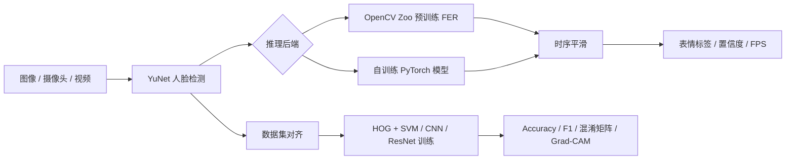

# 基于深度学习的人脸表情识别

> 一个从课程项目逐步完善到可训练、可评估、可视化并可实时运行的人脸表情识别项目。

项目最初使用一个简单的三层 CNN，在 FER2013 上训练几十轮后测试准确率约为 37%。后续版本完成了工程重构、训练流程改进、测试集评估、Grad-CAM 可视化和实时识别系统升级，并接入了 OpenCV Zoo 提供的高质量预训练表情模型。

当前版本默认使用 OpenCV Zoo 的 MobileFaceNet 表情识别模型作为实时推理后端，同时保留自训练 PyTorch 模型，便于继续学习和实验。

## 最终结果

FER2013 测试集结果：

| 方法 | Accuracy | Weighted F1 |
|---|---:|---:|
| HOG + SVM | 34.38% | 0.2881 |
| 原始三层 CNN | 37.24% | 0.3259 |
| 自训练 ResNet18 | 38.06% | 0.3319 |
| OpenCV Zoo 预训练模型 | **45.25%** | **0.3923** |

跨数据集结果：

| 模型 / 数据集 | Accuracy | Weighted F1 |
|---|---:|---:|
| 自训练 ResNet18 / CK+ | 25.10% | 0.2605 |
| OpenCV Zoo 预训练模型 / CK+ | **59.90%** | **0.5902** |

说明：

- OpenCV Zoo 预训练模型官方在 RAF-DB 上报告 88.27% Accuracy，但 FER2013 与 RAF-DB 存在明显领域差异，本项目在 FER2013 测试集上实测为 45.25%。
- 自训练模型的最佳验证准确率为 38.12%，测试准确率为 38.06%。
- 原始三层 CNN 使用原始检查点在当前评估流程中复现出 37.24% 测试准确率，说明数据与评估流程一致。
- CK+ 标签体系与 FER2013 不完全一致，跨数据集结果主要用于观察领域差异。

## 已完善的功能

- 统一路径、类别与设备配置，去除硬编码依赖
- 支持 FER2013、CK+ 数据加载、增强与类别平衡
- 支持 SimpleCNN、FER-CNN、MobileNetV3-Small、ResNet18
- 支持迁移学习、MixUp、RandomErasing、Label Smoothing、早停和余弦/Plateau 调度
- 支持断点续训与类别权重
- 输出 Accuracy、Weighted F1、Macro F1、分类报告和混淆矩阵
- 使用 Grad-CAM 展示模型关注区域
- 使用 YuNet 做人脸检测，并支持 MTCNN/Haar 回退
- 实时系统支持摄像头、视频、图片输入
- 实时系统包含时序平滑、FPS、人脸框和结果文件输出
- 默认使用 OpenCV Zoo 预训练 FER 模型，也可切换到自训练 PyTorch 模型
- 旧版原始 `code/emotion_best.pth` 可以直接被新版加载器兼容读取

## 项目流程



## 数据集

### FER2013

| 数据划分 | 图像数量 |
|---|---:|
| train | 23,212 |
| val | 5,383 |
| test | 5,384 |

类别：`angry`、`disgust`、`fear`、`happy`、`sad`、`surprise`、`neutral`

FER2013 存在明显类别不平衡。例如训练集中 `happy` 有 6,275 张，而 `disgust` 只有 380 张。训练脚本支持：

- 原分布训练
- WeightedRandomSampler 重采样
- 可调指数类别权重

### CK+

CK+ 用于跨数据集泛化评估。当前实现把 `contempt` 近似映射到 `disgust`。CK+ 数据集中没有 `neutral` 类，因此不能与 FER2013 结果做严格同分布比较。

数据集不随仓库上传，请从官方或合法渠道获取并遵守原始许可。

## 模型结构

### 1. OpenCV Zoo 预训练模型（实时默认）

- 文件：`models/facial_expression_recognition_mobilefacenet_2022july.onnx`
- 主干：MobileFaceNet
- 输入：112×112
- 类别：7 类
- 来源：OpenCV Zoo Facial Expression Recognition
- 许可证：Apache-2.0
- 官方 RAF-DB 准确率：88.27%
- 本项目 FER2013 测试准确率：45.25%
- 本项目 CK+ 测试准确率：59.90%

实时模式下会使用 YuNet 提供的 5 点关键点做人脸对齐，再进行表情分类。

### 2. 自训练 ResNet18

- 输入：96×96
- 初始化：ImageNet 预训练
- 最佳验证准确率：38.12%
- FER2013 测试准确率：38.06%
- 训练方式：分类头预热 + 全网络微调 + Plateau 调度
- 检查点：`exp_result/checkpoints/emotion_best.pth`

### 3. 原始三层 CNN

原始模型保留用于学习对照，新版加载器可以直接读取：

- 输入：48×48
- FER2013 测试准确率：37.24%
- 检查点：`code/emotion_best.pth`

### 4. HOG + SVM

- 输入：48×48 灰度图
- HOG：窗口 48×48，Cell 16×16，Block 8×8，9 个 bin
- 分类器：RBF SVM，`C=10`，`class_weight='balanced'`
- FER2013 测试准确率：34.38%

## 项目结构

```text
emotion_exp/
├── code/
│   ├── config.py                 # 路径、类别和默认配置
│   ├── data.py                   # 数据集、增强与采样
│   ├── model.py                  # 模型工厂、检查点与旧模型兼容
│   ├── train.py                  # 训练、续训、MixUp、调度
│   ├── judge.py                  # PyTorch 模型评估
│   ├── evaluate_pretrained.py    # OpenCV Zoo 模型评估
│   ├── compare.py                # 三种方法指标对比
│   ├── HOGSVM.py                 # HOG + SVM 基线
│   ├── visualize.py              # Grad-CAM 与特征图
│   ├── face_detector.py          # YuNet/MTCNN/Haar 检测封装
│   ├── pretrained_fer.py         # OpenCV Zoo FER 模型封装与对齐
│   ├── real_time.py              # 双后端实时推理
│   └── mtcnn_align.py            # 数据集人脸对齐
├── models/
│   ├── README.md
│   ├── face_detection_yunet_2023mar.onnx
│   └── facial_expression_recognition_mobilefacenet_2022july.onnx
├── dataset/                      # 本地数据集，不上传
├── exp_result/                   # 指标、混淆矩阵、本地模型
└── paper/                        # 课程资料
```

## 安装依赖

推荐 Python 3.10：

```powershell
python -m venv venv
.\venv\Scripts\Activate.ps1
pip install -r code\requirements.txt
```

## 数据目录

```text
dataset/
├── FER2013_aligned/
│   ├── train/{angry,disgust,fear,happy,sad,surprise,neutral}/
│   ├── val/{angry,disgust,fear,happy,sad,surprise,neutral}/
│   └── test/{angry,disgust,fear,happy,sad,surprise,neutral}/
└── CK+/
    ├── anger/
    ├── contempt/
    ├── disgust/
    ├── fear/
    ├── happy/
    ├── sadness/
    └── surprise/
```

原始 FER2013 可以使用：

```powershell
python code\mtcnn_align.py `
  --input dataset\FER2013 `
  --output dataset\FER2013_aligned
```

## 训练自模型

ResNet18 迁移学习示例：

```powershell
python code\train.py `
  --arch resnet18 `
  --image-size 96 `
  --batch-size 128 `
  --epochs 18 `
  --freeze-epochs 4 `
  --lr 1e-3 `
  --backbone-lr 1e-4 `
  --output-dir exp_result\checkpoints
```

断点续训：

```powershell
python code\train.py `
  --resume exp_result\checkpoints\emotion_last.pth `
  --epochs 30 `
  --arch resnet18 `
  --image-size 96
```

其他可选架构：

```text
mobilenet_v3_small
resnet18
fer_cnn
simple_cnn
```

## 评估

评估自训练 PyTorch 模型：

```powershell
python code\judge.py `
  --checkpoint exp_result\checkpoints\emotion_best.pth `
  --dataset both `
  --output-dir exp_result
```

评估 OpenCV Zoo 预训练模型：

```powershell
python code\evaluate_pretrained.py `
  --dataset both `
  --output-dir exp_result
```

生成方法对比：

```powershell
python code\HOGSVM.py
python code\compare.py
```

会生成：

- `exp_result/metrics.json`
- `exp_result/metrics_opencv.json`
- `exp_result/comparison.json`
- `exp_result/confusion_matrix_fer2013*.png`
- `exp_result/confusion_matrix_ckplus*.png`

## Grad-CAM

```powershell
python code\visualize.py `
  --checkpoint exp_result\checkpoints\emotion_best.pth `
  --samples-per-class 1 `
  --feature-maps
```

## 实时识别

默认使用 OpenCV Zoo 预训练模型，无需指定自训练检查点：

```powershell
python code\real_time.py `
  --backend opencv `
  --source 0 `
  --detector yunet
```

使用自训练 PyTorch 模型：

```powershell
python code\real_time.py `
  --backend torch `
  --checkpoint exp_result\checkpoints\emotion_best.pth `
  --source 0 `
  --detector yunet
```

图片输入：

```powershell
python code\real_time.py `
  --backend opencv `
  --source path\to\image.jpg `
  --output exp_result\result.jpg `
  --no-display
```

视频输入：

```powershell
python code\real_time.py `
  --backend opencv `
  --source path\to\video.mp4 `
  --output exp_result\result.mp4 `
  --no-display
```

按 `q` 或 `Esc` 退出摄像头/视频窗口。

## 学习总结

1. 通过原始模型复现确认了数据、标签和评估流程的可靠性。
2. 发现并修复了 MobileNet 分类头维度错误，避免无效实验继续消耗时间。
3. 对比了 HOG + SVM、简单 CNN、FER-CNN、MobileNetV3 和 ResNet18，理解了不同模型的适用条件。
4. 理解了类别不平衡、数据增强、MixUp、学习率调度和早停对训练的影响。
5. 认识到 FER2013 本身具有低分辨率、标签噪声和类别模糊问题，单靠更换模型不一定能持续提升。
6. 通过使用更匹配人脸任务的预训练模型，把 FER2013 测试准确率从 37.24% 提升到 45.25%。
7. 完成了从训练、评估、Grad-CAM 到摄像头/视频/图片部署的完整闭环。

## 当前局限

- FER2013 测试准确率仍受数据集噪声与领域差异限制。
- 自训练 ResNet18 在 FER2013 上仍存在明显过拟合。
- CK+ 标签映射为近似映射，跨数据集指标不能作为严格基准。
- OpenCV Zoo 模型主要针对 RAF-DB，迁移到 FER2013 后指标会下降。
- CPU 训练速度有限，没有进行大规模超参数搜索。
- 实时系统使用简单位置平滑，尚未加入完整的人脸跟踪。

## 后续计划

- 增加数据质量检查和标签清洗工具。
- 尝试 RAF-DB 等其他表情数据集的训练或微调。
- 在 GPU 环境进行完整超参数搜索。
- 对预训练模型进行 FER2013 微调，缩小领域差异。
- 加入 ONNX Runtime 或 OpenVINO 推理优化。
- 使用 ByteTrack 等轻量跟踪算法提升多人场景稳定性。
- 增加 Web 或桌面界面。

## 模型来源与许可

- [OpenCV Zoo Face Detection YuNet](https://github.com/opencv/opencv_zoo/tree/main/models/face_detection_yunet)，Apache-2.0
- [OpenCV Zoo Facial Expression Recognition](https://github.com/opencv/opencv_zoo/tree/main/models/facial_expression_recognition)，Apache-2.0
- [FER2013 Dataset](https://www.kaggle.com/datasets/msambare/fer2013)
- [CK+ Dataset Resources](http://www.jeffcohn.net/Resources/)

---

本仓库用于记录人脸表情识别项目的学习、实验、问题定位和功能完善过程。
