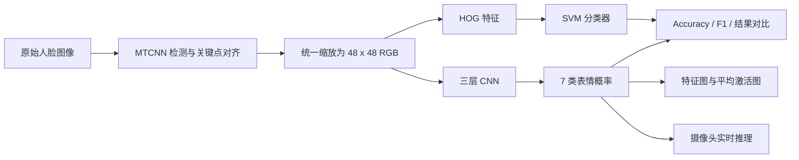

# 基于深度学习的人脸表情识别

> 一个用于机器学习与计算机视觉课程学习、复盘和记录的项目。  
> 项目在 Trae 中完成，核心目标是对比传统机器学习方法与深度学习方法的七类人脸表情识别效果，并进一步实现跨数据集评估、特征可视化和摄像头实时推理。

## 项目简介

人脸表情识别是计算机视觉中的典型分类任务。本项目围绕 7 类常见表情展开：

`angry`、`disgust`、`fear`、`happy`、`sad`、`surprise`、`neutral`

项目没有只停留在单一模型训练，而是完成了一套较完整的学习流程：

- 使用 MTCNN 对 FER2013 人脸图像进行检测、关键点对齐和统一缩放
- 构建 HOG + SVM 传统机器学习基线
- 构建包含 BatchNorm、Dropout 和 CutMix 的三层 CNN
- 在 FER2013 上训练和测试，在 CK+ 上做跨数据集泛化评估
- 统计 Accuracy、Weighted F1-score 和混淆矩阵
- 对卷积特征图和平均激活图进行可视化
- 使用 OpenCV + MTCNN 实现摄像头实时表情识别

> 这是一个学习型项目，重点关注“从数据处理到训练、评估、可视化、部署”的完整实践过程。当前模型结构较简单，实验指标主要用于和自身的传统方法基线作对比，不代表生产环境效果。

## 项目流程



## 数据集

### FER2013

FER2013 用于模型训练、验证和测试。

| 数据划分 | 原始图像数量 | 对齐后图像数量 |
|---|---:|---:|
| train | 25,120 | 23,212 |
| val | 5,383 | 5,383 |
| test | 5,384 | 5,384 |

MTCNN 脚本会将灰度图像转换为三通道，先放大到 96 x 96 进行检测，再根据双眼关键点进行旋转校正，最后裁剪并统一输出为 48 x 48。

### CK+

CK+ 主要用于测试模型在另一个数据集上的泛化能力。当前使用的数据包含：

| 表情目录 | 图像数量 | 映射到本项目类别 |
|---|---:|---|
| anger | 135 | angry |
| contempt | 54 | disgust |
| disgust | 176 | disgust |
| fear | 75 | fear |
| happy | 207 | happy |
| sadness | 84 | sad |
| surprise | 249 | surprise |

> CK+ 中没有 `neutral` 数据，`contempt` 也被近似映射为 `disgust`。因此 CK+ 结果更适合作为跨数据集学习和问题分析，不应直接与 FER2013 测试结果做严格意义上的同分布比较。

数据集仅保存在本地，不纳入 Git 仓库。使用时请从数据集官方或合法发布渠道获取，并遵守原始许可。

## 方法说明

### 1. HOG + SVM 基线

`HOGSVM.py` 提取传统手工特征作为对比基线：

- 输入尺寸：48 x 48 灰度图
- HOG：窗口 48 x 48，Cell 16 x 16，Block 8 x 8，9 个方向 bin
- 分类器：RBF 核 SVM
- 参数：`C=10`，`gamma='scale'`，`class_weight='balanced'`

### 2. 三层 CNN

`model.py` 中的 `EmotionNet` 由一个简单 CNN 构成：

| 阶段 | 结构 |
|---|---|
| Conv Block 1 | Conv 3→32, BatchNorm, ReLU, MaxPool |
| Conv Block 2 | Conv 32→64, BatchNorm, ReLU, MaxPool |
| Conv Block 3 | Conv 64→128, BatchNorm, ReLU, MaxPool |
| 分类头 | Dropout 0.5, Linear 128×6×6→7 |

模型同时保留中间特征图，供后续可视化和分析使用。

### 3. 训练策略

`train.py` 中的主要训练配置：

- 设备：CPU
- Epoch：50
- Batch Size：32
- 损失函数：CrossEntropyLoss
- 优化器：Adam，初始学习率 `1e-3`
- 学习率调度：StepLR，每 10 个 Epoch 乘以 0.5
- 数据增强：前 20 个 Epoch 后，以 30% 概率使用 CutMix
- 模型选择：保存验证集准确率最高的参数

### 4. 评估与可视化

- `judge.py`：计算 Accuracy、Weighted F1-score 和混淆矩阵，并分别在 FER2013、CK+ 上评估
- `compare.py`：对比 HOG + SVM 与 CNN 的指标
- `visualize.py`：输出三组卷积层特征图，以及基于最后一层特征平均值的简单激活图
- `real_time.py`：调用摄像头，结合 MTCNN 人脸检测完成实时表情分类与 FPS 显示

## 实验结果

当前提交对应的实验结果如下：

| 方法 / 数据集 | Accuracy | Weighted F1-score |
|---|---:|---:|
| HOG + SVM / FER2013 test | 34.38% | 0.2881 |
| 三层 CNN / FER2013 test | **37.24%** | **0.3259** |
| 三层 CNN / CK+ 跨数据集测试 | 26.53% | 0.2775 |

相对 HOG + SVM 基线，CNN 在 FER2013 测试集上的表现提升：

- Accuracy：`+2.86` 个百分点
- Weighted F1-score：`+0.0378`

### 结果分析

1. CNN 能够从数据中自动学习局部纹理与形状特征，在该数据集和当前配置下略优于手工 HOG 特征。
2. 整体准确率仍然有限，说明简单 CNN、CPU 训练、数据量、类别不平衡和表情标注歧义都会影响结果。
3. CK+ 跨数据集结果明显下降，体现了不同数据集在人物、采集条件、表情定义和标签体系上的分布差异。
4. 当前 `visualize.py` 输出的是特征图和平均激活图，并非严格的 Grad-CAM，结果主要用于直观观察网络响应。

## 项目结构

```text
emotion_exp/
├── code/
│   ├── HOGSVM.py          # HOG + SVM 基线
│   ├── compare.py         # 两种方法指标对比
│   ├── judge.py           # 测试集与跨数据集评估
│   ├── model.py           # CNN 与 FocalLoss 定义
│   ├── mtcnn_align.py     # MTCNN 人脸检测与对齐
│   ├── real_time.py       # 摄像头实时推理
│   ├── requirements.txt   # Python 依赖
│   ├── train.py           # CNN 训练脚本
│   └── visualize.py       # 特征图和激活图可视化
├── dataset/               # 本地数据集，不上传
├── exp_result/            # 指标文本与可视化结果
├── paper/                 # 课程报告等资料
└── venv/                  # 本地虚拟环境，不上传
```

Git 仓库只提交源码、说明文档和指标文本；数据集、虚拟环境、模型权重和由数据集生成的图片默认不提交。

## 快速开始

### 1. 创建环境

```powershell
cd D:\emotion_exp
python -m venv venv
.\venv\Scripts\Activate.ps1
pip install -r code\requirements.txt
```

### 2. 准备数据目录

```text
dataset/
├── FER2013/
│   ├── train/{angry,disgust,fear,happy,sad,surprise,neutral}/
│   ├── val/{angry,disgust,fear,happy,sad,surprise,neutral}/
│   └── test/{angry,disgust,fear,happy,sad,surprise,neutral}/
├── FER2013_aligned/
│   ├── train/...
│   ├── val/...
│   └── test/...
└── CK+/
    ├── anger/
    ├── contempt/
    ├── disgust/
    ├── fear/
    ├── happy/
    ├── sadness/
    └── surprise/
```

### 3. 运行脚本

```powershell
# 人脸检测、对齐并生成 FER2013_aligned
python code\mtcnn_align.py

# 训练 CNN
python code\train.py

# 在 FER2013 和 CK+ 上评估
python code\judge.py

# 训练并评估 HOG + SVM
python code\HOGSVM.py

# 对比两种方法的指标
python code\compare.py

# 生成特征图与激活图
python code\visualize.py

# 打开摄像头实时识别
python code\real_time.py
```

> 当前源码中的数据集路径、模型路径和输出路径使用了 `D:\emotion_exp\...` 绝对路径。换到其他电脑或目录运行时，需要先修改这些常量。后续可以将路径统一改为命令行参数或配置文件。

## 学习总结

通过这个项目，我完成了从“单个算法练习”到“完整视觉项目”的一次串联，主要收获包括：

- 理解了图像分类项目的基本流程：数据组织、预处理、训练、验证、测试和结果分析。
- 理解了卷积、池化、BatchNorm、Dropout、学习率调度和 CutMix 在 CNN 中的作用。
- 通过 HOG + SVM 与 CNN 的对照实验，认识了手工特征和自动特征学习的差异。
- 学会使用 Accuracy、F1-score、混淆矩阵和跨数据集评估，而不是只关注单一准确率。
- 学会把 MTCNN、PyTorch 和 OpenCV 串起来，完成从静态图片到摄像头实时推理的完整流程。
- 认识到模型效果不仅取决于网络结构，还受到数据质量、类别分布、标签定义和实验设置的影响。

## 当前局限

- CNN 结构较浅，没有使用预训练模型或迁移学习。
- 训练在 CPU 上完成，搜索空间和训练轮次受限。
- FER2013 存在类别不平衡、标签噪声和低分辨率问题。
- CK+ 的类别映射是近似处理，且缺少 neutral 类，跨数据集指标的解释需要谨慎。
- 代码中的路径为绝对路径，可移植性不足。
- 激活图使用特征平均，不是严格意义上的 Grad-CAM 或 CAM。
- `model.py` 中定义了 FocalLoss，但当前训练脚本仍使用 CrossEntropyLoss。

## 后续计划

- 将绝对路径改为配置文件或命令行参数。
- 增加随机裁剪、翻转、亮度调整等数据增强。
- 对比 ResNet18、MobileNetV3 等预训练模型。
- 使用类别权重、Focal Loss 或重采样方法处理类别不平衡。
- 实现标准 Grad-CAM，提升可视化解释性。
- 增加训练曲线、混淆矩阵图片和误差样本分析。
- 将实时推理封装为更易用的桌面或 Web Demo。
- 在保持代码清晰的前提下，尝试 GPU 训练和更规范的实验记录。

## 参考资料

- [FER2013 Dataset](https://www.kaggle.com/datasets/msambare/fer2013)
- [CK+ Dataset Resources](http://www.jeffcohn.net/Resources/)
- [MTCNN Python Implementation](https://github.com/ipazc/mtcnn)
- [CutMix: Regularization Strategy to Train Strong Classifiers with Localizable Features](https://arxiv.org/abs/1905.04899)

---

如果这个项目对你有帮助，欢迎通过 Issue 记录新的想法、问题或改进方向。这个仓库也会作为我学习计算机视觉和深度学习过程的一份阶段记录。
